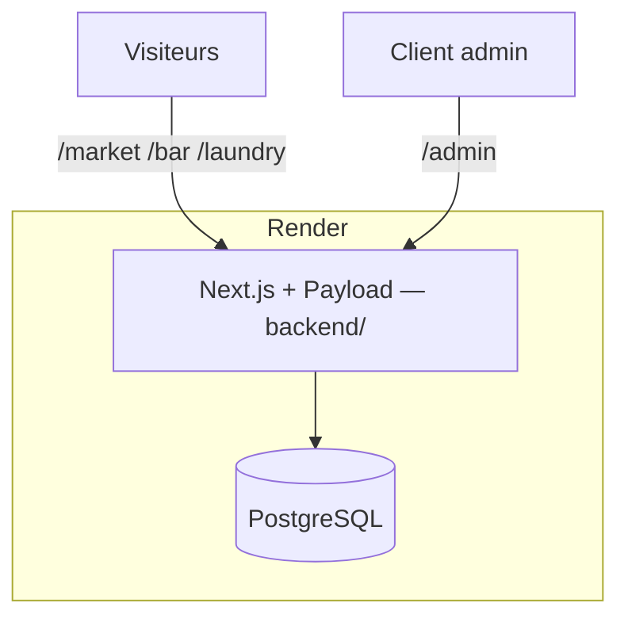

# SOLIS TRILL

Application monolithe **Next.js + Payload CMS** pour SOLIS TRILL :

- **SOLIS Market** — catalogue produits par catégories
- **SOLIS Bar** — cocktails signature + configurateur personnalisé
- **SOLIS Laundry** — offres pressing + devis en ligne
- **/admin** — back-office Payload (gestion du contenu)

## Architecture



| Composant | Rôle |
|-----------|------|
| `backend/` | Application complète (site + API + admin) |
| PostgreSQL | Données (Render en production) |
| Docker | Développement local sans Node installé |

Les pages publiques lisent les données **directement via Payload** (pas d'appel HTTP externe). Les formulaires (commandes, devis) postent vers `/api/*` sur le même domaine.

## Démarrage local (Docker)

Prérequis : [Docker Desktop](https://www.docker.com/products/docker-desktop/) démarré

```bash
docker compose up --build
```

Puis peupler la base :

```bash
docker compose exec web npm run seed
```

| URL | Contenu |
|-----|---------|
| http://localhost:3000 | Site public |
| http://localhost:3000/admin | Back-office Payload |

**Compte admin (après seed)** : `admin@solis-trill.fr` / `SolisTrill2025!`  
Changez ce mot de passe dès la première connexion.

## Structure

```
SOLIS/
├── backend/                 # Application monolithe
│   ├── src/
│   │   ├── app/
│   │   │   ├── (frontend)/  # Pages publiques
│   │   │   └── (payload)/   # Admin + API REST
│   │   ├── collections/     # Schéma Payload
│   │   ├── components/      # UI React
│   │   ├── lib/
│   │   │   ├── data.ts      # Lecture directe Payload (server)
│   │   │   └── client-api.ts # POST formulaires (client)
│   │   └── seed/            # Données sample
│   ├── Dockerfile
│   └── package.json
└── docker-compose.yml
```

## Déploiement Render

1. Créer une base **PostgreSQL** sur Render
2. Créer un **Web Service** — dossier racine : `backend/`
3. Variables d'environnement :

| Variable | Valeur |
|----------|--------|
| `DATABASE_URI` | URL interne PostgreSQL Render |
| `PAYLOAD_SECRET` | Chaîne aléatoire (32+ caractères) |
| `NEXT_PUBLIC_SERVER_URL` | URL publique Render (ex. `https://solis-trill.onrender.com`) |
| `NODE_ENV` | `production` |

4. Build : `npm install && npm run build`
5. Start : `npm start`
6. Exécuter le seed une fois :

```bash
npm run seed
```

Un fichier `render.yaml` est fourni pour un déploiement Blueprint.

## Gestion du contenu (client)

Connexion à `https://votre-app.onrender.com/admin` :

| Section | Contenu |
|---------|---------|
| SOLIS Market | Catégories, produits, prix |
| SOLIS Bar | Ingrédients, cocktails, matériel |
| SOLIS Laundry | Offres pressing |
| Commandes | Commandes cocktails, demandes de devis |

## Fonctionnalités

- [x] Catalogue Market (paiement marqué « bientôt disponible »)
- [x] Configurateur cocktail + commande
- [x] Devis Laundry en ligne
- [x] Back-office Payload en français
- [x] Seed de données sample
- [ ] Paiement en ligne
- [ ] Notifications email admin

## Commandes utiles

```bash
docker compose logs -f web
docker compose exec web npm run generate:types
docker compose down
```
